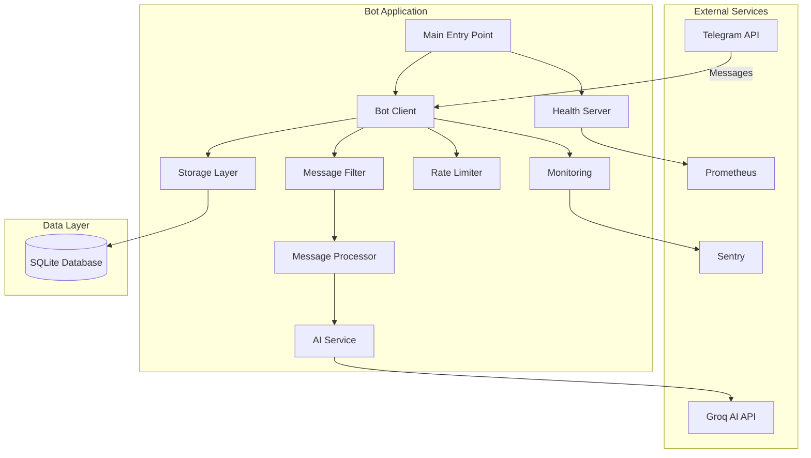
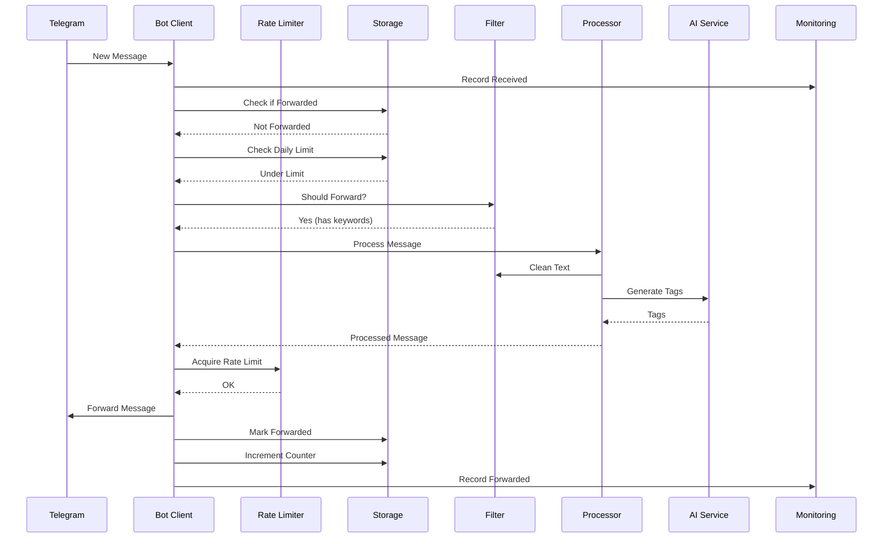
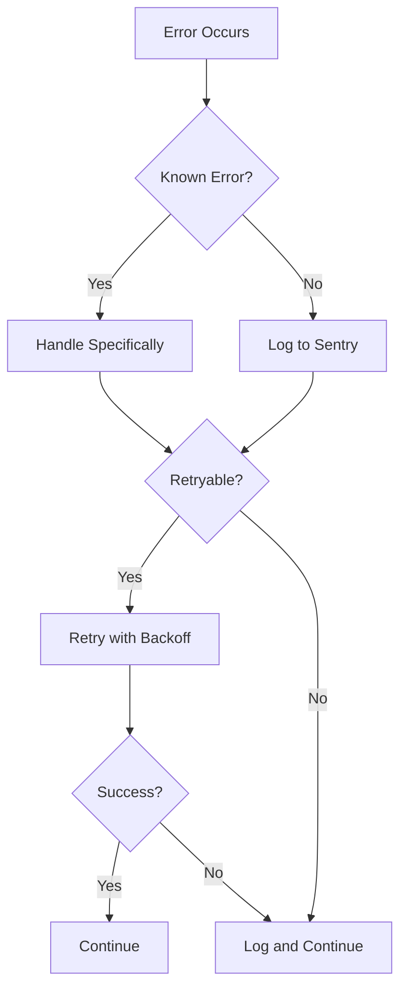

# Architecture Documentation

## System Overview

The Telegram News Bot is a production-ready application built with a modular architecture for reliability, maintainability, and scalability.

## Architecture Diagram



## Component Breakdown

### 1. Main Entry Point (`bot/main.py`)

**Responsibility**: Application initialization and lifecycle management

- Loads configuration
- Initializes all services
- Sets up signal handlers for graceful shutdown
- Manages application lifecycle

### 2. Bot Client (`bot/client.py`)

**Responsibility**: Core bot logic and message handling

- Manages Telegram connections (userbot + bot API)
- Coordinates message processing pipeline
- Handles callbacks from review buttons
- Integrates all services

**Key Methods**:
- `start()`: Initialize and start bot
- `_handle_new_message()`: Process incoming messages
- `shutdown()`: Graceful shutdown

### 3. Configuration (`bot/config.py`)

**Responsibility**: Configuration management with validation

- Pydantic-based configuration
- Environment variable parsing
- Validation of all settings
- Type-safe access

### 4. Storage Layer (`bot/storage.py`)

**Responsibility**: Persistent state management

- SQLite database operations
- Message tracking (prevent duplicates)
- Daily post counters
- Database migrations

**Key Features**:
- Async operations with aiosqlite
- Automatic schema creation
- Migration support
- Statistics tracking

### 5. Message Filter (`bot/filters.py`)

**Responsibility**: Message filtering logic

- Keyword matching (enforced!)
- Spam detection
- Text cleaning
- Pattern-based filtering

### 6. Message Processor (`bot/processors.py`)

**Responsibility**: Message processing pipeline

- Text cleaning
- AI tag generation
- Length validation and truncation
- Media handling

### 7. AI Service (`bot/ai_service.py`)

**Responsibility**: AI-powered hashtag generation

- Groq API integration
- Fallback to rule-based tagging
- Error handling and retry logic

### 8. Rate Limiter (`bot/rate_limiter.py`)

**Responsibility**: Prevent API abuse

- Token bucket algorithm
- Per-minute and per-hour limits
- Exponential backoff
- FloodWaitError handling

### 9. Monitoring (`bot/monitoring.py`)

**Responsibility**: Observability and error tracking

- Sentry integration for errors
- Prometheus metrics
- Performance tracking
- Breadcrumb logging

**Metrics Exposed**:
- `bot_messages_received_total`
- `bot_messages_forwarded_total`
- `bot_messages_rejected_total`
- `bot_errors_total`
- `bot_daily_posts`
- `bot_message_processing_seconds`
- `bot_rate_limiter_waits_total`
- `bot_database_operation_seconds`

### 10. Health Check Server (`bot/health.py`)

**Responsibility**: Health and readiness probes

**Endpoints**:
- `GET /health` - Liveness probe
- `GET /ready` - Readiness probe
- `GET /metrics` - Prometheus metrics
- `GET /stats` - Human-readable statistics

## Data Flow

### Message Processing Flow



## Database Schema

### Tables

#### `forwarded_messages`
```sql
CREATE TABLE forwarded_messages (
    id INTEGER PRIMARY KEY AUTOINCREMENT,
    message_id TEXT UNIQUE NOT NULL,
    source_channel TEXT NOT NULL,
    forwarded_at TIMESTAMP DEFAULT CURRENT_TIMESTAMP,
    message_text TEXT,
    created_at TIMESTAMP DEFAULT CURRENT_TIMESTAMP
);
```

#### `daily_stats`
```sql
CREATE TABLE daily_stats (
    id INTEGER PRIMARY KEY AUTOINCREMENT,
    date DATE UNIQUE NOT NULL,
    posts_count INTEGER DEFAULT 0,
    created_at TIMESTAMP DEFAULT CURRENT_TIMESTAMP,
    updated_at TIMESTAMP DEFAULT CURRENT_TIMESTAMP
);
```

#### `schema_version`
```sql
CREATE TABLE schema_version (
    version INTEGER PRIMARY KEY,
    applied_at TIMESTAMP DEFAULT CURRENT_TIMESTAMP
);
```

## Deployment Architecture

### Local Development

```
Developer Machine
├── Python 3.11+
├── SQLite Database
├── .env configuration
└── Health Server :8080
```

### Production (Railway)

```
Railway Container
├── Docker Container
│   ├── Python 3.11 slim
│   ├── Non-root user
│   ├── Health checks
│   └── Bot Application
├── Environment Variables
├── Persistent Volume (for session)
└── Health Check Endpoint
```

## Error Handling Strategy

### Levels of Error Handling

1. **Specific Exceptions**: Catch known errors (FloodWaitError, etc.)
2. **Retry Logic**: Exponential backoff for transient failures
3. **Monitoring**: All errors logged to Sentry
4. **Graceful Degradation**: Fallback mechanisms (AI → rules)
5. **Circuit Breaker**: Rate limiter prevents cascading failures

### Error Flow



## Monitoring and Observability

### Metrics Collection

- **Prometheus**: Time-series metrics
- **Sentry**: Error tracking and performance
- **Logs**: Structured logging to file and stdout

### Health Checks

- **Liveness**: Is the process running?
- **Readiness**: Can it handle requests?
- **Database**: Is database accessible?

## Security Considerations

1. **Secrets Management**: Environment variables, never committed
2. **Session Files**: Never committed to Git
3. **Non-root User**: Docker runs as non-root
4. **Input Validation**: Pydantic validates all config
5. **Rate Limiting**: Prevents abuse
6. **Error Sanitization**: Sensitive data not logged

## Performance Characteristics

### Expected Performance

- **Message Processing**: < 500ms per message
- **Database Operations**: < 50ms per query
- **Memory Usage**: ~50-100MB
- **CPU Usage**: < 5% idle, < 20% active

### Scalability

- **Horizontal**: Not designed for horizontal scaling (session-based)
- **Vertical**: Can handle 1000s of messages/day on minimal resources
- **Database**: SQLite sufficient for expected load

## Future Improvements

1. **PostgreSQL**: For multi-instance deployments
2. **Redis**: For distributed caching
3. **Webhooks**: Alternative to long-polling
4. **Admin Dashboard**: Web UI for management
5. **ML-based Filtering**: Advanced content classification

---

**Version**: 2.0.0  
**Last Updated**: 2026-02-08
